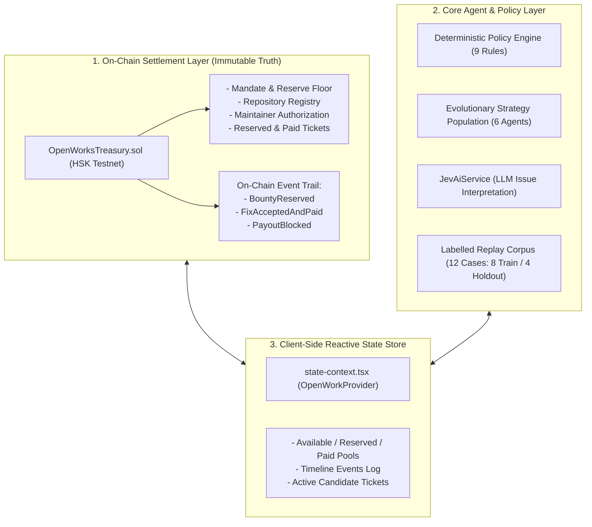

# OpenWorks — Database & Agent Architecture

**Status:** Documented & Verified  
**Date:** 26 September 2026

---

## 1. Is the Steward Driven by the Agent?

> **Fundamental Invariant:** **NO. The Steward is NOT driven by the Agent, and MUST NEVER be driven by the Agent.**

### Architectural Separation:
- **The Steward (Human Principal / Treasury Governor)**:
  - Deploys and funds the fixed public-goods pool (`OpenWorksTreasury.sol`).
  - Publishes and updates the **immutable spending mandate** (maximum bounty per ticket, maximum spend per round, minimum uncommitted reserve floor, mandate expiry).
  - Approves or removes eligible open-source repositories.
  - Holds the emergency **pause authority** (`onlySteward`).
- **The Agent (Strategy Champion)**:
  - Operates strictly **inside** the Steward's mandate bounds.
  - Selects **which eligible issues to fund and proposes the bounty amount up to the ticket cap**.
  - **Cannot** change money caps, lower reserve floors, add unapproved repositories, or unpause the contract.

If an AI agent could drive or override the Steward, it would create an existential custody breach where an autonomous model could self-allocate funds, inflate bounty limits, or bypass emergency stops. The smart contract enforces this separation via distinct access control roles:
```solidity
modifier onlySteward() {
    if (msg.sender != steward) revert UnauthorizedCaller();
    _;
}

modifier onlyStewardOrChampion() {
    if (msg.sender != steward && msg.sender != championAgent) revert UnauthorizedCaller();
    _;
}
```

---

## 2. Current Database Architecture

In the current prototype, OpenWorks uses an **On-Chain + Event-Sourced / State-Context Hybrid Architecture**:



### Current Data Storage Layers:
1. **On-Chain Ledger (`OpenWorksTreasury.sol`)**:
   - Primary source of financial and authorization truth.
   - Holds token balances, committed reservations, maintainer signatures, and immutable event logs.
2. **Replay Corpus & Benchmarks (`packages/core/src/demo-data.ts`)**:
   - Labelled historical tickets with ground truth urgency, impact, and resolution outcomes used for strategy evaluation and holdout validation.
3. **Reactive State Context (`web/src/lib/state-context.tsx`)**:
   - In-memory event-sourced store connecting user actions in the Next.js UI to the canonical `@openwork/core` engine.

### Production Scaling Path:
- **Off-Chain Indexer (The Graph / Goldsky / Envio)**: Indexes contract events (`BountyReserved`, `FixAcceptedAndPaid`, `PayoutBlocked`) into GraphQL queries.
- **Relational DB (PostgreSQL / Supabase + Prisma)**: Stores raw GitHub issue webhooks, comments, and contributor profile associations.
- **Vector DB (pgvector / Qdrant)**: Stores embeddings of issue descriptions for semantic similarity search and duplicate intake detection.

---

## 3. Jev AI Integration

### What does Jev AI do?
According to Section 4 of the Brief:
> *"The model may interpret issue language; it cannot waive a hard rule."*

The newly created **[`JevAiService`](file:///c:/Users/Fate_Conqueror/GitHub/OpenWork/packages/core/src/jev-ai-service.ts)** accepts raw issue titles, markdown bodies, and attached evidence URLs, calling the Jev AI endpoint to extract:
1. **Semantic Urgency** ($0.0 - 1.0$)
2. **Breadth of Effect / Blast Radius** ($0.0 - 1.0$)
3. **Public Benefit** ($0.0 - 1.0$)
4. **Feasibility of Acceptance Criteria** ($0.0 - 1.0$)
5. **Evidence Confidence** ($0.0 - 1.0$)
6. **Detailed Step-by-Step Rationales**

### Configuration:
Configuration files have been initialized:
- Root [`.env`](file:///c:/Users/Fate_Conqueror/GitHub/OpenWork/.env) and [`.env.example`](file:///c:/Users/Fate_Conqueror/GitHub/OpenWork/.env.example)
- Frontend [`web/.env.local`](file:///c:/Users/Fate_Conqueror/GitHub/OpenWork/web/.env.local)

When `JEV_AI_API_KEY` is provided, live LLM completions are used. If empty or during offline testing, the service automatically uses deterministic heuristic fallback, ensuring 100% test reliability.
