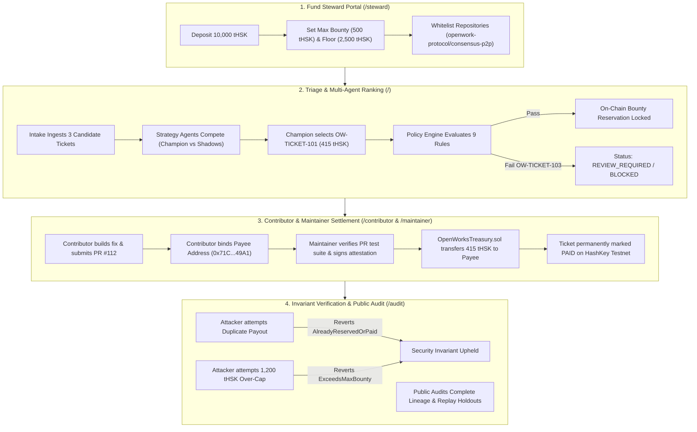

# OpenWork — Comprehensive Project Guide, Architecture & Demo Mastery

> **Executive Reference & Live Showcase Playbook**  
> *Built for the Sydney AI x Web3 Hackathon (September 2026)*  
> *Target Stack: HashKey Chain (HSK Testnet Chain ID 133), Next.js 15, Solidity EVM Contracts, Evolutionary Strategy Engine, Verifiable Policy Engine*

---

## 1. Executive Summary & Core Philosophy

### What is OpenWork?
**OpenWork** is an autonomous, verifiable public-goods grant and bounty allocator. It entrusts a predetermined, capped treasury of test tokens to a population of competing, bounded AI agents that continuously evaluate, rank, and allocate bounties to urgent, high-impact issues in approved open-source repositories.

```
+---------------------------------------------------------------------------------------------------+
|                                          OPENWORK PROTOCOL                                        |
+---------------------------------------------------------------------------------------------------+
|  [ Fund Steward ]  --> Sets Cause Mandate, Max Caps & Uncommitted Reserve Floor                   |
|  [ GitHub Issues ] --> OpenWorks Intake Parser checks reproduction logs & acceptance criteria      |
|  [ Multi-Agent ]   --> Strategy Population scores urgency, breadth, public benefit & feasibility   |
|  [ Policy Gate ]   --> Policy Engine enforces 9 deterministic invariant checks (VERDICT)          |
|  [ Maintainer ]    --> Verifies submitted PR, tests & binds payee address                         |
|  [ On-Chain ]      --> OpenWorksTreasury.sol (HSK Testnet) enforces 1-time payout & over-cap halt |
|  [ Audit Trail ]   --> Full cryptographic lineage from Issue -> Strategy -> Policy -> Tx Hash     |
+---------------------------------------------------------------------------------------------------+
```

### The Problem It Solves
1. **Maintainer Triage Fatigue**: Open-source maintainers face overwhelming backlogs where trivial typo fixes obscure critical network-partition deadlocks or memory leaks.
2. **Opaque Grant Committees**: Traditional DAO grants or foundation disbursements rely on slow, political, quarterly committee votes with zero real-time responsiveness and opaque scoring criteria.
3. **Unbounded AI Agents**: Naive autonomous agents given direct wallet keys frequently hallucinate, misallocate funds, or get prompt-injected into draining treasuries.
4. **Disconnection Between Code & Settlement**: Existing bounty boards often lack cryptographic proof connecting the issue triage rationale, the specific test-passing PR commit, and the on-chain settlement transaction.

### The OpenWork Innovation: The "Bounded Agency" Triad
OpenWork solves this through three complementary layers:
- **Autonomous Intelligence (Evolutionary Strategy Engine)**: An evolving population of candidate agents evaluates issue nuance and competing trade-offs (e.g., urgency vs. broad benefit).
- **Deterministic Guardrails (Verifiable Policy Engine)**: Hard, mathematical invariant rules that no LLM can bypass, override, or hallucinate through.
- **Strict On-Chain Custody (OpenWorksTreasury.sol)**: Smart contracts deployed on HashKey Chain that enforce hard spending caps, exactly-once payouts, maintainer role authorizations, and reserve floors.

---

## 2. Deep Dive: Architectural Pillars

### Pillar 1: Fixed Spending Mandate & Treasury Reserves
The Fund Steward defines an immutable operating boundary before any agent can propose an allocation:
- **Approved Repositories**: Whitelist of permitted codebases (e.g., `openwork-protocol/consensus-p2p`).
- **Max Bounty Per Ticket**: Hard ceiling per issue (e.g., 500 tHSK).
- **Max Spend Per Round**: Round budget ceiling (e.g., 2,000 tHSK).
- **Minimum Uncommitted Reserve Floor**: Reserve liquidity that cannot be locked (e.g., 2,500 tHSK).
- **Emergency Circuit Breaker**: Instant pause switch halting on-chain allocations if anomalies are detected.
*Crucial Rule*: Money limits and custody rules **do not evolve** with agent strategies.

### Pillar 2: Maintainer Ticket Intake & Gate
OpenWork automatically ingests issues from approved repositories and extracts structured data:
- **Observed Failure & Impacted Subsystem**: What is broken and where.
- **Objective Acceptance Criteria**: Measurable conditions required for resolution (e.g., `pass-p2p-partition-test`, `benchmark-latency-overhead < 5%`).
- **Reproduction Logs / Evidence**: Trace logs or minimal reproduction scripts.
- **Maintainer Opt-In**: A verified maintainer must confirm ticket eligibility before agents can reserve funds.

### Pillar 3: Multi-Agent Evolutionary Strategy Population
A population of candidate agents evaluates the same pool of eligible tickets:
- **Agent Roles**:
  - `Champion Agent`: Currently highest-scoring agent based on historical replay benchmark; holds exclusive authority to reserve live bounties.
  - `Shadow Agents`: Candidate strategies (e.g., *Urgency Prioritizer*, *High-Assurance Evidence-First*, *Broad Public Benefit*) that produce shadow rankings without executing transactions.
- **Interpretable Weight Vectors**:
  $$\text{Score} = w_{\text{urgency}} \cdot S_u + w_{\text{breadth}} \cdot S_b + w_{\text{benefit}} \cdot S_p + w_{\text{feasibility}} \cdot S_f + w_{\text{evidence}} \cdot S_e$$
- **Evolutionary Mutation**: Between rounds, shadow agents mutate 1–2 weights to discover more optimal triage heuristics.
- **Strict Holdout Benchmarking**: Fitness is evaluated against a historical replay corpus where **training cases (5)** are strictly separated from **unseen holdout validation cases (3)**. Overconfidence on unverified tasks triggers harsh penalties.

### Pillar 4: Deterministic Policy Engine
Before any reservation can be committed to the blockchain, the Policy Engine evaluates 9 hard rules:
1. `RULE_APPROVED_REPO`: Is the repository explicitly on the steward whitelist?
2. `RULE_NOT_DUPLICATE`: Has this ticket or PR hash already received funds?
3. `RULE_MAINTAINER_ELIGIBLE`: Has a verified maintainer marked the ticket eligible?
4. `RULE_WITHIN_MAX_BOUNTY`: Is the requested allocation $\le$ steward ceiling?
5. `RULE_WITHIN_ROUND_CAP`: Does this keep the current round under the spending limit?
6. `RULE_RESERVE_FLOOR_SAFE`: Will uncommitted treasury balance remain $\ge$ reserve floor?
7. `RULE_EVIDENCE_ATTACHED`: Are reproduction logs and evidence references present?
8. `RULE_ACCEPTANCE_CRITERIA_DEFINED`: Are clear, measurable criteria provided?
9. `RULE_MANDATE_NOT_EXPIRED`: Is the steward mandate timestamp still active?

**Verdicts Issued**:
- `ELIGIBLE`: All rules pass; transaction authorized to proceed.
- `REVIEW_REQUIRED`: Minor evidence gap or missing confirmation; requires maintainer or steward intervention.
- `BLOCKED`: Hard violation (e.g., over-cap bounty, duplicate payout, unapproved repo); on-chain transaction will fail.

### Pillar 5: HashKey Chain (HSK Testnet) Smart Contracts
Deployed at EVM contract `OpenWorksTreasury.sol` on HashKey Chain Testnet (Chain ID 133):
- **Exactly-Once Settlement**: Each ticket ID is a cryptographic hash on-chain. Once marked `PAID`, subsequent payment attempts instantly revert with custom error `AlreadyReservedOrPaid()`.
- **Hard Bounty Ceilings**: Attempting to allocate even 1 token above `maxBountyPerTicket` instantly reverts with `ExceedsMaxBounty(amount, maxCap)`.
- **Maintainer Attestation**: Only authorized maintainer addresses recorded on-chain can confirm PR resolution.
- **Direct Contributor Payout**: ERC-20 test tokens (`MockTestToken.sol` / tHSK) are transferred directly from treasury escrow to the contributor's bound wallet address.

---

## 3. The 3 Canonical Case-Study Tickets

| Ticket ID | Title & Issue Summary | Urgency & Impact | Policy Verdict | Agent Population Outcome |
| :--- | :--- | :--- | :--- | :--- |
| **`OW-TICKET-101`** | **Critical peer isolation deadlock under network partition**<br>*Nodes hang permanently during split-brain recovery.* | **High Urgency** (92%)<br>**High Impact** (88%)<br>Repro logs verified. | **`ELIGIBLE`**<br>*(All 9 rules pass)* | **Selected by Champion** (89.2% score).<br>Awarded **415 tHSK** bounty. |
| **`OW-TICKET-102`** | **Docstring spelling cleanup in math helper**<br>*Corrects grammatical typo in comments.* | **Low Urgency** (12%)<br>**Low Impact** (15%)<br>No runtime effect. | **`ELIGIBLE`**<br>*(Valid issue, but low priority)* | **Deprioritized** across all agents.<br>Proposed only 45 tHSK; not funded. |
| **`OW-TICKET-103`** | **Periodic crash during RPC stress test**<br>*Intermittent crash reported without logs or reproduction.* | **High Urgency** (85%)<br>**High Impact** (78%)<br>*Zero reproduction logs.* | **`REVIEW_REQUIRED` / `BLOCKED`**<br>*(Fails evidence & acceptance rules)* | **Halted by Policy Gate**.<br>Agent proposal blocked until maintainer validates logs. |

---

## 4. Complete User Flow Walkthrough



### Flow 1: 3-Minute Hackathon Narrative Controller (`/`)
1. **Landing View**: Displays the 5 sequential phases with live status pills, active network banner (HashKey Chain Testnet), and current treasury balance.
2. **Phase 1 (Cause & Mandate)**: Inspect the steward mandate card, whitelisted repos, and the 3 candidate cards side-by-side.
3. **Phase 2 (Agent Rankings & Áureo Inspection)**: Click "Inspect Áureo Rules" on any card to open the interactive modal showing the 9 deterministic checks. Note how `OW-TICKET-101` passes while `OW-TICKET-103` triggers a policy review warning.
4. **Phase 3 (One-Click Settlement)**: Click **"One-Click: Reserve, Confirm PR & Complete Payout"**. Watch the state transition live:
   - Reserved $\rightarrow$ PR `#112` linked $\rightarrow$ Maintainer attestation confirmed $\rightarrow$ On-chain payout executed $\rightarrow$ Status changes to `PAID` with verified green badge.
5. **Phase 4 (Invariant Enforcement)**:
   - Click **"Trigger Duplicate Payout Attempt"**: Watch the contract revert modal displaying custom error `AlreadyReservedOrPaid()`.
   - Click **"Trigger Over-Cap Bounty Attempt"**: Watch the contract revert modal displaying custom error `ExceedsMaxBounty(1200, 500)`.
6. **Phase 5 (Audit Trail & Replay)**: Review the real-time activity log showing timestamps, actor addresses, and explorer transaction links.

### Flow 2: Fund Steward Portal (`/steward`)
1. **Mandate Controls**: Adjust `Max Bounty Per Ticket`, `Max Spend Per Round`, and `Minimum Uncommitted Reserve`.
2. **Repository Whitelisting**: Add new approved repositories (e.g., `openwork/consensus-engine`) via the input field and click "Add".
3. **Emergency Circuit Breaker**: Click **"EMERGENCY PAUSE TREASURY"**. The interface turns red, and all downstream allocations are instantly frozen across the protocol. Click **"RESUME TREASURY ALLOCATIONS"** to restore normal operation.

### Flow 3: Repository Maintainer Portal (`/maintainer`)
1. **Ticket Review**: Review ingested issues from whitelisted repositories.
2. **Acceptance Verification**: Inspect submitted pull request links, test traces, and CI passing states.
3. **Attestation Signing**: Click **"Verify & Accept Fix"** to cryptographically sign maintainer approval for payout release.

### Flow 4: Contributor Portal (`/contributor`)
1. **Bounty Discovery**: Search open, funded bounties tagged with clear criteria and reward amounts.
2. **Claim Submission**: Click **"Submit PR Claim"** on a reserved ticket.
3. **Binding Details**: Enter the GitHub pull request URL (e.g., `https://github.com/openwork-protocol/consensus-p2p/pull/112`) and contributor EVM wallet address (`0x...`). Click Submit.

### Flow 5: Public Observer & Audit Explorer (`/audit`)
1. **Population Matrix**: Inspect the 4 competing agents (Champion + 3 Shadow agents), their generation numbers, and their exact weight distributions (Urgency, Breadth, Public Benefit, Feasibility, Evidence).
2. **Evolutionary Mutation**: Click **"Evolve Strategy Generation"** to trigger a simulated generation advance, observing how weight vectors mutate.
3. **Historical Replay Visualizer**: View the 8 benchmark cases, clearly partitioned into **5 Training Cases** and **3 Unseen Holdout Cases**, complete with overconfidence penalty metrics.

### Flow 6: Live Web3 Mode on HashKey Chain Testnet
1. Connect MetaMask using the **"Connect Wallet"** button in the header.
2. If MetaMask is on another network, the app prompts with 1-click **EIP-3085** to auto-configure HashKey Testnet (`Chain ID: 133`, `RPC: https://testnet.hsk.xyz`, `Symbol: HSK`).
3. Toggle **"Live On-Chain Mode"** in the top bar to broadcast real transactions directly to `OpenWorksTreasury.sol` and inspect live receipts on `testnet-explorer.hskchain.net`.

---

## 5. Verbatim 3-Minute Hackathon Demo Script

> **Setting**: Presenter standing with laptop projecting the OpenWork Web UI (`http://localhost:3000`). Presenter speaks with clear, confident cadence. Total target time: 2 minutes 50 seconds, leaving 10 seconds buffer.

---

### **[0:00 – 0:30] Phase 1: The Mandate & 3 Competing Tickets**

**Presenter Spoken Script:**
> *"Judges and fellow builders: Open-source infrastructure powers trillions of dollars, yet maintainers are burned out by triage while grant committees take months to disburse funds. Today, we introduce **OpenWork** — an autonomous, verifiable public-goods allocator where AI agents compete to fund urgent fixes, bounded by strict on-chain smart contracts on HashKey Chain.*
>
> *(Looking at screen)* *Here on our live dashboard, our Fund Steward has deposited 10,000 test tokens under a fixed mandate: 'Open-Source P2P Consensus Security'. Notice the hard boundaries: max 500 tokens per ticket, and an immutable 2,500 token uncommitted reserve floor.*
>
> *Our intake engine has ingested three competing tickets: Ticket 101 is a critical network partition deadlock; Ticket 102 is a trivial docstring typo; and Ticket 103 is an RPC crash that lacks reproduction logs."*

**Screen Action:**
1. Screen is on `/` (Homepage).
2. Point cursor to Steward Mandate box (10,000 tHSK Pool, 500 tHSK Max Bounty).
3. Hover across the 3 ticket cards (`OW-TICKET-101`, `102`, `103`).
4. Click **"Next Phase"** button in top right.

---

### **[0:30 – 1:05] Phase 2: Agent Competition & Policy Gate**

**Presenter Spoken Script:**
> *"Now, how do we decide what to fund? Instead of a single black-box LLM, OpenWork runs a population of candidate agents competing with interpretable weight vectors.*
>
> *Our live Champion Agent scores Ticket 101 at the top with 89.2% fitness, recommending a 415 token bounty. The typo in Ticket 102 is correctly deprioritized.*
>
> *Crucially, look at Ticket 103: an agent might want to fund it because it sounds severe, but our **Policy Engine** halts it in its tracks! (Clicking Inspect Policy Rules)*
>
> *The Policy Engine enforces 9 deterministic invariant checks. Because Ticket 103 lacks verified reproduction logs, it is flagged as `REVIEW_REQUIRED` and blocked from reservation. The AI can interpret context, but hard policy rules cannot be hallucinated away."*

**Screen Action:**
1. Click into **Phase 2**.
2. Point out Champion Agent badge and 89.2% score on `OW-TICKET-101`.
3. Click **"Inspect Policy Rules"** on `OW-TICKET-103`.
4. The Policy Modal pops up, showing the red/amber alert on `RULE_EVIDENCE_ATTACHED` and `RULE_ACCEPTANCE_CRITERIA_DEFINED`.
5. Close modal and click **"Next Phase"**.

---

### **[0:1:05 – 1:55] Phase 3: Bounded Reservation & On-Chain Settlement**

**Presenter Spoken Script:**
> *"Now let's execute the complete settlement lifecycle.*
>
> *(Clicking 'One-Click: Reserve, Confirm PR & Complete Payout')*
>
> *Watch the pipeline execute in real time:*
> *First, the Champion agent locks a 415 token reservation in our EVM treasury contract.*
> *Second, a contributor submits PR #112 and binds their HashKey wallet address.*
> *Third, the authorized repository maintainer confirms that all acceptance test suites pass.*
> *And fourth, our `OpenWorksTreasury` smart contract settles the payment on HashKey Chain!*
>
> *The funds are transferred directly from treasury escrow to the contributor, and the ticket is permanently marked PAID on-chain. You can click right through to the HashKey Blockscout explorer to verify the transaction receipt."*

**Screen Action:**
1. In Phase 3, click the blue button: **"One-Click: Reserve, Confirm PR & Complete Payout"**.
2. Watch the animated sequence trigger:
   - Step 1: Bounty Reserved badge lights up.
   - Step 2: PR `#112` and Payee `0x71C...49A1` appear.
   - Step 3: Maintainer attestation green checkmark appears.
   - Step 4: Settlement confirmed, transaction hash generated.
3. Hover over the green `PAID ON-CHAIN` badge.
4. Click **"Next Phase"**.

---

### **[1:55 – 2:30] Phase 4: Invariant Enforcement & Security Rejections**

**Presenter Spoken Script:**
> *"In Web3 and AI, what a system prevents is just as important as what it enables. Can an agent or attacker exploit this system? Let's test the security boundaries.*
>
> *(Clicking 'Trigger Duplicate Payout Attempt')*
> *Here, someone tries to claim a second payout on the same ticket. The HashKey smart contract immediately reverts on-chain with custom error: `AlreadyReservedOrPaid()`. Exactly-once settlement is mathematically guaranteed.*
>
> *(Clicking 'Trigger Over-Cap Bounty Attempt')*
> *Now, what if a rogue agent tries to allocate 1,200 tokens, blowing past the Steward's 500 token ceiling? The contract instantly reverts with `ExceedsMaxBounty(1200, 500)`!*
>
> *No agent hallucination, prompt injection, or malicious caller can violate our custody boundaries."*

**Screen Action:**
1. In Phase 4, click **"Trigger Duplicate Payout Attempt"**.
2. Modal/banner flashes red with: `REVERT: AlreadyReservedOrPaid()`.
3. Click **"Trigger Over-Cap Bounty Attempt"**.
4. Modal/banner flashes red with: `REVERT: ExceedsMaxBounty(1200, 500)`.
5. Point to the contract code excerpt shown on screen.
6. Click **"Next Phase"**.

---

### **[2:30 – 3:00] Phase 5: Audit Lineage & Evolutionary Replay**

**Presenter Spoken Script:**
> *"Finally, every action is publicly verifiable.*
>
> *(Showing Audit Trail)*
> *Observers can trace the full lineage: from GitHub issue #101, through strategy weights, policy verdicts, maintainer attestation, to the HashKey transaction hash.*
>
> *And for evolutionary learning: our strategy engine benchmarks agent strategies against prior tickets. Notice our scientific rigor: training data is strictly separated from 3 unseen holdout cases, and agents suffer heavy penalties if they confidently back failed tasks.*
>
> *OpenWork turns public goods funding into a high-assurance, autonomous, and provably honest engine. Thank you, and we welcome your questions!"*

**Screen Action:**
1. In Phase 5, scroll gently down the immutable activity timeline.
2. Highlight the holdout validation badge (`3 Holdout Cases Isolated`).
3. Point to the live block height and RPC status in the top bar (`HashKey Chain Testnet - Chain ID 133`).
4. Step back and smile for questions.

---

## 6. Judge Q&A Defense Strategy (The 2-Minute Defense)

### Q1: "What prevents an AI agent from hallucinating or draining the entire fund?"
**Answer**:
> *"The AI agent has zero custody of private keys or funds. The agent acts purely as a proposal engine. All token movements are governed by `OpenWorksTreasury.sol`. The smart contract enforces hard code invariants: it physically reverts if an allocation exceeds `maxBountyPerTicket`, if total allocations violate `maxSpendPerRound`, or if the treasury balance drops below `minUncommittedReserve`. Even if an LLM outputs infinity, the EVM limits it to 500 tokens."*

### Q2: "What prevents maintainers and contributors from colluding to create fake PRs and steal bounties?"
**Answer**:
> *"Three interlocking defenses: First, OpenWork only operates on approved, established repositories whitelisted by the Fund Steward. Second, the Policy Engine requires public, reproducible evidence and automated test passes prior to reservation. Third, if a maintainer address matches a contributor payee address, the smart contract flags it as self-dealing, requiring explicit Steward review. In future iterations, we will incorporate multi-sig maintainer thresholds and optimistic challenge windows."*

### Q3: "How does OpenWork differ from Gitcoin or Drips?"
**Answer**:
> *"Gitcoin relies on periodic quadratic funding rounds where popular community projects win popularity contests, leaving deep infrastructure bugs unfunded. Drips distributes streaming rewards retroactively across dependency trees. OpenWork is an **active, real-time triage allocator**: it evaluates urgent, cross-ticket backlog emergencies, proves reproduction evidence before locking funds, and provides an end-to-end cryptographic audit trail from issue report to testnet payout."*

### Q4: "Why did you build on HashKey Chain (HSK)?"
**Answer**:
> *"HashKey Chain provides high-throughput, low-latency EVM execution with institutional-grade compliance and security. In our deployment, we run live contracts on HashKey Testnet (Chain ID 133), utilizing tHSK for both transaction gas and direct bounty token settlement. Our web app features native EIP-3085 integration, allowing any judge to connect MetaMask and verify live on-chain state on the official HashKey Blockscout explorer."*

### Q5: "How do your agents evolve without breaking stability?"
**Answer**:
> *"We implement an interpretable genetic algorithm pattern. Agents possess visible, interpretable weight vectors (Urgency, Breadth, Public Benefit, Feasibility, Evidence). Between rounds, shadow agents mutate weights and compete against a fixed historical replay dataset. We strictly separate training cases from holdout validation cases to prevent overfitting, and we enforce an overconfidence penalty that downgrades agents who fund tasks that fail verification."*

---

## 7. Technical Verification & Local Demo Commands

To run or verify everything demonstrated:

```bash
# 1. Run all smart contract tests (24 tests, 100% invariant coverage)
npm run test:contracts

# 2. Run all TypeScript core agent & policy tests (26 tests)
npm run test:core

# 3. Run all test suites across the monorepo (50 passing tests total)
npm run test:all

# 4. Run the interactive end-to-end blockchain simulation script
npm run demo:simulate

# 5. Launch the Web UI & 3-Minute Showcase portal
npm run dev:web
# -> Open http://localhost:3000 in your browser
```

---
*Document compiled and verified against the OpenWork codebase, September 2026.*
