# OpenWorks — Operational Agent Architecture vs. Issue Parsing

**Status:** Conceptual & Architectural Clarification  
**Date:** 26 September 2026

---

## 1. What is "Issue Parsing"?

In standard software workflows, an **"Issue"** is simply an operational defect report, task, or incident ticket. 

**"Issue Parsing"** is the ingestion gateway:
- It takes a raw human report (describing what failed, error logs, environment details, and expected behavior).
- It normalizes that report into a structured data object:
  - **Identified Failure**: Exactly what broke in the system.
  - **Affected Component**: The module, service, or contract involved.
  - **Acceptance Criteria**: What must be true for the fix to be considered complete.
  - **Evidence References**: Links to logs, reproduction traces, or telemetry.

In the prototype brief, GitHub issues were used as the concrete example because open-source software backlogs are public and inspectable. However, **issue parsing is just the data normalization step**—it is not the core intelligence of OpenWorks.

---

## 2. Why OpenWorks is About Operational Usage, Not Just GitHub

The core value of OpenWorks and the integrated AI (Jev AI + Strategy Engine) is **Operational Capital Allocation and Triage Intelligence**:

```mermaid
flowchart LR
    subgraph OperationalInput ["1. Operational Event / Task"]
        Incident["System Incident / Defect Report"]
        Evidence["Telemetry, Test Logs, Repro Trace"]
    end

    subgraph OperationalIntelligence ["2. Operational Agent (Jev AI + Strategy Engine)"]
        Triage["Operational Triage: Severity & Blast Radius"]
        CapAlloc["Capital Allocation: How much bounty to reserve?"]
        CondCheck["Acceptance Verification: Can this fix be objectively proven?"]
    end

    subgraph OperationalGovernance ["3. Fixed Mandate & Custody (Policy Engine + Contract)"]
        Mandate["Spending Mandate & Reserve Floor"]
        Settlement["One-Time Settlement upon Verified Completion"]
    end

    OperationalInput --> OperationalIntelligence
    OperationalIntelligence --> OperationalGovernance
```

### The 4 Operational Jobs of the Agent:
1. **Operational Severity Triage**:
   - Determining whether an incoming ticket represents a critical operational emergency (e.g. validator consensus stall, data corruption, peer isolation) vs routine cosmetic maintenance.
2. **Blast Radius & Impact Assessment**:
   - Calculating the breadth of effect across the operational infrastructure (e.g. does this affect 100% of nodes in a network partition, or an isolated utility?).
3. **Operational Feasibility & Acceptance Verification**:
   - Checking whether the proposed acceptance criteria are deterministic and measurable (e.g. "reproduces 3 dropped peers with zero goroutine leaks and recovers in < 800ms") rather than vague promises.
4. **Autonomous Bounded Capital Allocation**:
   - Recommending the exact bounty amount to reserve from the treasury pool within the steward's pre-set spending cap.

---

## 3. Decoupling from GitHub to Pure Operational Usage

OpenWorks does not require GitHub specifically. In a pure operational deployment, the input can be:
- **Infrastructure Incident Alerts** (e.g., PagerDuty / Datadog / Grafana incident reports).
- **Security Audit Findings** (e.g., penetration test or bug bounty submissions).
- **Core Protocol Improvement Tasks** (e.g., network protocol upgrades).
- **DAO / Public Goods Requests** (e.g., operational tooling maintenance).

In all cases, the operational loop remains identical:
1. An operational task is ingested.
2. The AI evaluates operational severity and evidence.
3. The Champion reserves a bounded bounty under the Steward's mandate.
4. The fix is delivered and verified against published acceptance conditions.
5. The smart contract executes a single settlement payment.
