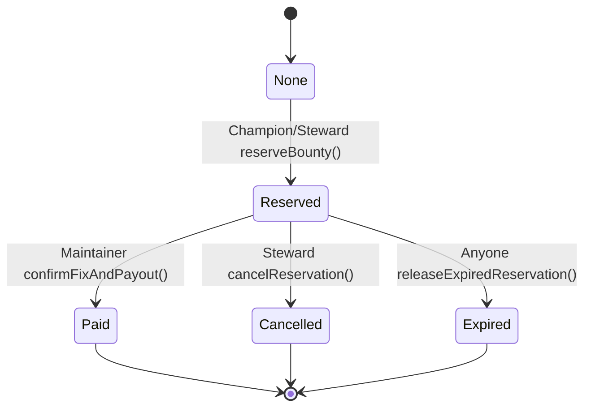

# OpenWorks — Smart Contracts Specification & Verification Report

**Status:** Built, Compiled, and Verified (24/24 Tests Passing, E2E Simulation Passing)  
**Date:** 26 September 2026  
**Target Environment:** EVM / HashKey Chain (HSK) Testnet Compatible

---

## 1. Overview & Core Mission

`OpenWorksTreasury` is the on-chain settlement and custody layer for OpenWorks. It operates as a deterministic, bounded allocator of test funds (ERC-20 `tHSK`) for open-source bug fixes and security improvements.

The contract enforces hard constraints that cannot be bypassed by off-chain agents or LLM strategies:
1. **Steward-Defined Mandate:** Bounded maximum bounty per ticket, maximum round spend cap, minimum uncommitted reserve floor, and strict mandate expiration.
2. **Repository & Maintainer Access Control:** Only maintainers approved by the Steward for a specific repository can confirm accepted fixes and authorize payouts.
3. **Agent Bounded Reservations:** Champion Agents can only reserve bounties within the ticket cap, round spend cap, and without breaching the uncommitted reserve floor.
4. **Single-Use Settlement:** Every ticket ID can only be paid once. Duplicate payout attempts are immediately rejected on-chain.
5. **Emergency Pause:** The Fund Steward can immediately freeze reservations and payouts in case of platform or off-chain anomalies.

---

## 2. Architecture & Contracts

### 2.1 `MockTestToken.sol`
- **Standard:** ERC-20 (OpenZeppelin v5) with Ownable.
- **Name:** "OpenWorks Test HSK"
- **Symbol:** "tHSK"
- **Decimals:** 18
- **Minting:** Open minting utility for test suites and sandbox demo actors.

### 2.2 `OpenWorksTreasury.sol`
- **Token:** Immutable `IERC20 token` reference.
- **Security:** ReentrancyGuard, SafeERC20, explicit custom errors.

#### State Machine & Ticket Lifecycle


### 2.3 Custom Errors Table

| Error | Condition Triggered |
|---|---|
| `ContractPaused()` | Any reservation or payout attempted while steward pause switch is active |
| `MandateExpired()` | Action attempted past `mandateExpiry` timestamp |
| `UnauthorizedCaller()` | Caller is neither Steward nor designated Champion Agent |
| `UnauthorizedMaintainer()` | Payout confirmation attempted by address not registered as maintainer for the target repo |
| `RepositoryNotApproved()` | Reservation attempted on an unapproved or removed repository |
| `AlreadyReservedOrPaid()` | Ticket ID has already been reserved or paid |
| `TicketNotReserved()` | Confirmation attempted on a ticket not in `Reserved` status |
| `ExceedsMaxBounty()` | Proposed bounty amount exceeds `maxBountyPerTicket` |
| `ExceedsRoundSpend()` | Proposed bounty would push cumulative round spend past `maxSpendPerRound` |
| `ViolatesMinReserve()` | Proposed bounty would reduce uncommitted treasury balance below `minUncommittedReserve` |
| `InsufficientBalance()` | Treasury does not hold enough token balance for the reservation |
| `InvalidPayee()` | Payee address specified as `address(0)` |
| `ReservationExpired()` | Payout attempted after the ticket's reservation duration has lapsed |
| `ReservationNotExpired()` | Early release attempted before reservation duration has lapsed |

---

## 3. Test Coverage & Verification

Test suite: `contracts/test/OpenWorksTreasury.test.ts`  
Command: `npm test` or `npm run test:contracts`

### Test Results: 24 / 24 Passing
```
  OpenWorksTreasury
    Initialization & Mandate State
      ✔ should initialize with correct steward, champion, and mandate limits
      ✔ should allow steward to update mandate and emit event
      ✔ should reject non-steward updating mandate
    Maintainer Registry
      ✔ should verify approved repositories and maintainers
      ✔ should allow steward to remove maintainer
      ✔ should reject non-steward adding maintainer
    Bounty Reservation
      ✔ should allow champion agent to reserve a valid bounty within limits
      ✔ should allow steward to reserve a bounty directly
      ✔ should reject unauthorized caller reserving bounty
      ✔ should reject reservation for unapproved repository
      ✔ should reject over-cap bounty reservation (exceeds maxBountyPerTicket)
      ✔ should reject duplicate reservation on the same ticketId
      ✔ should reject reservation violating minimum uncommitted reserve
      ✔ should reject reservation that exceeds round spend limit
    Acceptance & Payout Workflow
      ✔ should allow authorized maintainer to confirm fix and pay contributor
      ✔ should reject confirmation from an unauthorized non-maintainer
      ✔ should reject duplicate payout attempt on same ticket (already paid)
      ✔ should reject payout to zero address
      ✔ should reject payout for non-existent ticket
    Emergency Pause & Mandate Expiry
      ✔ should reject actions when paused and resume when unpaused
      ✔ should reject actions when mandate has expired
    Reservation Expiry and Cancellation
      ✔ should allow anyone to release an expired reservation back to uncommitted balance
      ✔ should reject maintainer confirmation on expired reservation
      ✔ should allow steward to cancel a reservation and return reserved funds

  24 passing
```

---

## 4. End-to-End Simulation Script

Script: `contracts/scripts/simulate.ts`  
Command: `npm run simulate` or `npm run demo:simulate`

### Execution Walkthrough
1. **Deploy & Fund:** Deploys `MockTestToken` and `OpenWorksTreasury`, funds Treasury with 5,000 tHSK, approves `openwork/core-engine`, and registers maintainer.
2. **Initial State:** Verified Treasury uncommitted balance is 5,000 tHSK; Contributor balance is 0 tHSK.
3. **Reservation:** Champion Agent successfully reserves 450 tHSK for `OW-2026-CRIT-001`. Total reserved is now 450 tHSK; uncommitted balance decreases to 4,550 tHSK.
4. **Acceptance & Payout:** Maintainer accepts PR `https://github.com/openwork/core-engine/pull/133` and confirms payout to Contributor. Contributor receives 450 tHSK. Ticket state transitions to `Paid`.
5. **Duplicate Payout Rejection:** Re-attempting confirmation on `OW-2026-CRIT-001` reverts with `AlreadyReservedOrPaid()`.
6. **Over-Cap Reservation Rejection:** Attempting to reserve 650 tHSK (above the 500 tHSK cap) for `OW-2026-OVERCAP-TEST` reverts with `ExceedsMaxBounty()`.
7. **Unauthorized Maintainer Rejection:** Attempting payout confirmation from an attacker account reverts with `UnauthorizedMaintainer()`.

---

## 5. Artifacts and Integration Paths

- Contracts Root: `c:\Users\Fate_Conqueror\GitHub\OpenWork\contracts`
- Typechain Typings: `contracts/typechain-types`
- Artifacts & ABIs: `contracts/artifacts/contracts/OpenWorksTreasury.sol/OpenWorksTreasury.json`
- Deployment Script: `contracts/scripts/deploy.ts`
- Simulation Script: `contracts/scripts/simulate.ts`
- Monorepo Shortcuts:
  - `npm run test:contracts`
  - `npm run demo:simulate`
